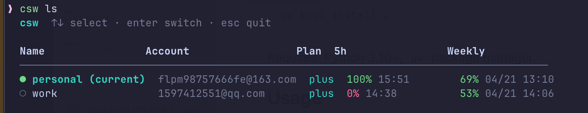

# csw — Codex Switcher

Lightweight CLI and desktop app to switch between multiple OpenAI Codex accounts.

## Features

- **Instant account switching** — backs up & replaces `~/.codex/auth.json` atomically
- **Interactive selector** — arrow-key list with real-time usage display
- **Usage quota display** — shows 5h / weekly remaining % with reset times via `/backend-api/wham/usage`
- **File cache** — usage data cached to disk (5 min TTL), no repeated API calls
- **Token expiry check** — warns if access_token is expired before switching
- **Process detection** — warns if Codex CLI is currently running
- **Duplicate detection** — prevents saving the same account twice
- **Desktop app** — Tauri app for macOS, Windows, and Linux

## Install

### One-click install

```bash
 curl -fsSL https://raw.githubusercontent.com/Autumn0716/codex-switcher/master/install.sh | bash
```

### Manual install

```bash
git clone https://github.com/Autumn0716/codex-switcher.git
cd codex-switcher
uv tool install .
```

Requires: Python 3.10+, `uv` package manager.

### Desktop app development

The desktop app is built with Tauri v2, Rust, React, and TypeScript.

```bash
npm install
npm run tauri:dev
```

Build a local desktop bundle:

```bash
npm run tauri:build
```

Platform requirements:

- **macOS**: Xcode Command Line Tools (`xcode-select --install`). Signed public distribution requires an Apple Developer account and notarization.
- **Windows**: Microsoft C++ Build Tools with "Desktop development with C++", Microsoft Edge WebView2 Runtime, and the Rust MSVC toolchain.
- **Linux**: WebKitGTK 4.1 development packages and build tools. On Debian/Ubuntu:

```bash
sudo apt update
sudo apt install libwebkit2gtk-4.1-dev build-essential curl wget file libxdo-dev libssl-dev libayatana-appindicator3-dev librsvg2-dev
```

## Usage

Use `codex login`to record the `auth.json` file,and `csw add <name>`to add your profile.Then you can use `csw ls`to switch your so many accounts easily.



```
csw add <name>        # Save current account as a profile
csw ls                # Interactive list (arrow keys) with usage info
csw switch <name>     # Switch to a profile
csw current           # Show active profile
csw balance           # Check usage/balance for current account
csw rm <name>         # Remove a profile
csw mv <old> <new>    # Rename a profile
```

## How it works

- Profiles stored in `~/.csw/profiles/` as copies of `auth.json`
- Active profile tracked in `~/.csw/config.json`
- Usage data cached in `~/.csw/cache/<name>.json` (5 min TTL)
- File permissions set to `0o600` for all sensitive files
- Atomic writes via `temp + os.rename()`
- The desktop app keeps token reads/writes in the Rust backend and only sends redacted display data to the UI.

## License

MIT
