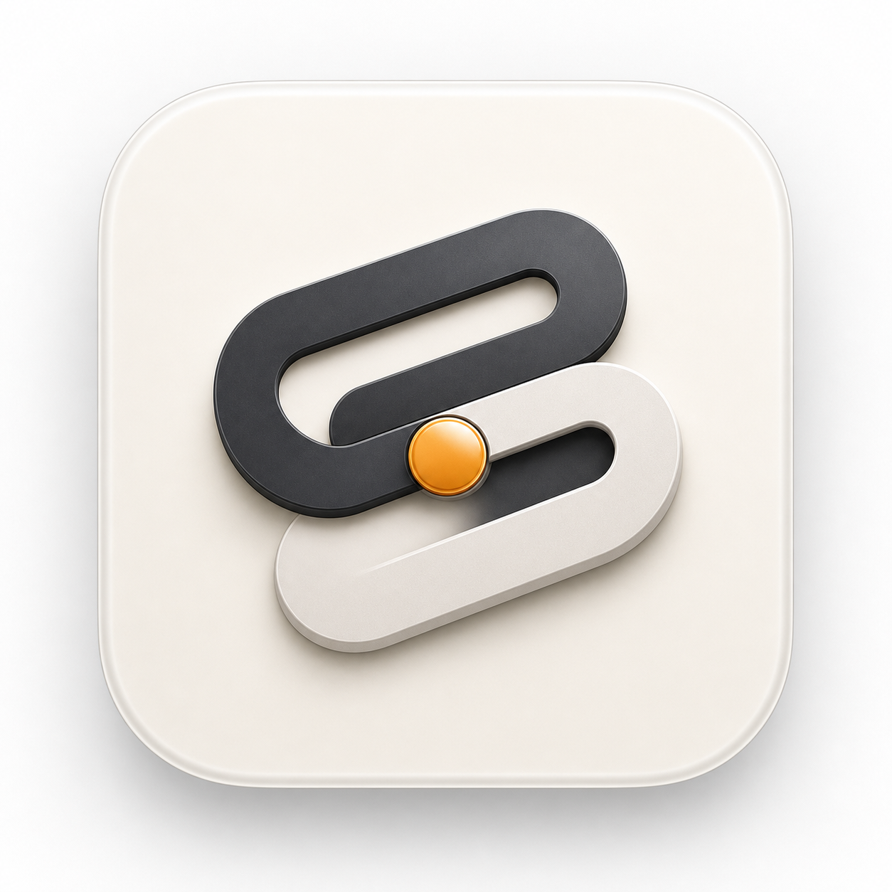
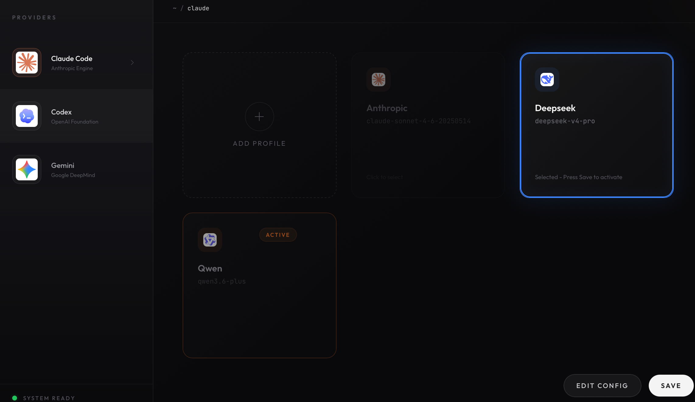
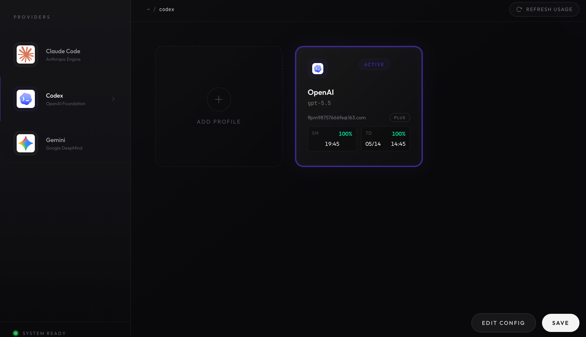

# Code Switcher

多 AI 提供商账号管理桌面应用。在 Claude Code、Codex、Gemini 和任意 OpenAI 兼容端点之间自由切换，无需手动编辑配置文件。

**[Tauri v2 桌面应用]** + **[Python CLI (`csw`)]** — 两套界面，同一份配置存储。



## 界面预览





## 核心功能

### 配置文件管理

为每个支持的编程工具保存提供商 JSON 文件，然后从桌面界面选择或激活。

- **添加配置** — 打开编辑对话框；点击「确认」创建一个新的提供商卡片和 JSON 文件
- **编辑配置** — 更新提供商字段并生成对应的配置内容
- **保存** — 激活选中品牌的提供商
- **删除** — 通过暗色主题确认弹窗删除单个提供商

每张卡片对应 `~/.csw/config/<brand>/` 下的一个 JSON 文件。

### 基于供应商的文件命名

配置文件以供应商名称命名（如 `zai.json`、`deepseek.json`、`qwen.json`），而非无意义的时间戳 ID。当同名供应商文件已存在时，自动添加人类可读的时间戳后缀（如 `deepseek-20260507-1530.json`）。

### 自定义提供商编辑器

将任意 OpenAI 兼容 API 端点接入为首选提供商。

- 输入 API 基础 URL、模型名称和 API 密钥
- 自动生成目标工具所需的 `auth.json` 和 `config.toml`
- API 密钥不会完整显示 — 预览仅展示首尾各 4 个字符
- 覆盖写入前自动备份原有文件

### Coding Plan 标记

Coding Plan 类型的供应商（Zai Coding、Qwen Coding、Mimo Coding）卡片上会显示 **CP** 徽标，与普通计划一目了然地区分开。

### 提供商仪表盘

每张卡片概览提供商的配置状态：

- 活跃模型名称和版本
- Codex 账户邮箱、套餐、5 小时用量窗口、周用量窗口、重置时间
- Token 限制、温度和流式传输设置
- 连接健康状态

### 安全保证

- **原子写入** — 所有文件写入采用临时文件 + rename 策略，防止写入中断导致文件损坏
- **自动备份** — 每次覆盖的 auth/config 文件都会以 `.bak.{timestamp}` 后缀备份
- **权限锁定** — Unix 系统下 auth 文件权限设为 `0600`
- **JWT 过期检测** — 从 JWT 声明中解析 token 过期时间并在 UI 中展示
- **账户 ID 哈希** — 配置文件显示账户 ID 的 SHA-256 哈希，从不暴露原始凭证

## 架构

| 层级 | 技术 |
|------|------|
| 桌面外壳 | Tauri v2（Rust 后端 + React 前端） |
| 前端 | React 18、TypeScript、Framer Motion、Phosphor Icons、Tailwind CSS v4 |
| 后端 | Rust（`serde`、`serde_json`、`toml`、`sha2`、`base64`） |
| IPC | Rust 通过 Tauri 命令暴露给 React UI |
| 存储 | 本地文件系统（`~/.csw/`、`~/.codex/`、`~/.code-switcher/`） |

### 文件布局

```
~/.csw/
├── config/
│   ├── claude/            # 提供商 JSON，如 anthropic.json、deepseek.json
│   ├── codex/             # 提供商 JSON，如 openai.json、qwen.json
│   └── gemini/            # 提供商 JSON，如 google.json
├── prompts/               # 提示词文档
├── diagrams/              # 架构和设计文档
├── data/logs.db           # 请求日志和使用量汇总
├── backups/               # 备份
├── profiles/              # 已保存的 Codex auth 快照
└── config.json            # 活跃 Codex CLI 配置文件追踪

~/.codex/
└── auth.json              # 当前活跃的凭证

~/.code-switcher/
├── custom-providers.json  # 自定义提供商注册表
└── providers/             # 每个提供商的 auth.json + config.toml
```

## 快速开始

### 前置要求

- **Rust 工具链** — `rustup default stable`
- **Node.js** — v20 或以上

### 开发模式

```bash
npm install
npm run app:dev          # Tauri 桌面应用 + Vite 开发服务器
```

`npm run app:dev` 是日常开发入口。前端改动会热重载到运行中的应用。Rust 后端改动需要重新构建或重启。

纯 Vite 模式仅用于浏览器 UI 检查（无法调用 Tauri 命令）：

```bash
npm run dev
```

### 本地文件测试

```bash
npm run app:dev
```

然后：
1. 在桌面应用中编辑一个提供商配置
2. 保存或激活该配置
3. 检查 `~/.csw/config/<brand>/` 下对应的 JSON 文件
4. 重启应用并确认配置从磁盘加载

Codex 认证测试流程：
1. 打开 Codex 提供商编辑界面
2. 点击「Codex 登录」；应用在后台运行 `codex login`
3. 应用会打开 Codex CLI 返回的 OpenAI 认证页面
4. Codex 登录成功后会写入 `~/.codex/auth.json`
5. 应用导入该文件到当前 Codex 提供商

应用默认生成的 Codex 配置：

```toml
[codex]
model = "gpt-5.5"
model_provider = "openai"
model_context_window = 1000000
model_auto_compact_token_limit = 900000
model_reasoning_effort = "xhigh"
approvals_reviewer = "user"
```

### 构建桌面应用

macOS：

```bash
npm run tauri:build        # .app 应用包
npm run tauri:build:dmg    # .dmg 安装文件
```

构建产物位置：`src-tauri/target/release/bundle/macos/code-switcher.app`

Linux（需要 Linux 环境）：

```bash
npm run linux:build        # .deb、.rpm、.AppImage
npm run linux:build:docker # 从 macOS 使用 Docker 包装
```

Windows：安装 Microsoft C++ Build Tools + Rust MSVC 工具链，然后运行 `npm run tauri:build`。

## CLI 命令行工具

`csw` 命令提供终端方式的配置管理。

```bash
curl -fsSL https://raw.githubusercontent.com/Autumn0716/code-switcher/main/install.sh | bash
```

```bash
csw add <name>        # 保存当前账号为配置文件
csw ls                # 列出所有配置并交互切换
csw switch <name>     # 切换到指定配置
csw current           # 显示当前活跃配置
csw balance           # 查看当前账号的 Token 用量
csw rm <name>         # 删除配置
csw mv <old> <new>    # 重命名配置
```

## 发布版本

- **v0.1.0**（2026-05-07）— 首个 Tauri v2 桌面应用发布，macOS Apple Silicon DMG
  - 多品牌 Provider 管理（Claude / Codex / Gemini）
  - 基于供应商的文件命名
  - Coding Plan 卡片标记
  - 暗色主题删除确认弹窗
  - 原子 JSON 写入

## 许可证

MIT
